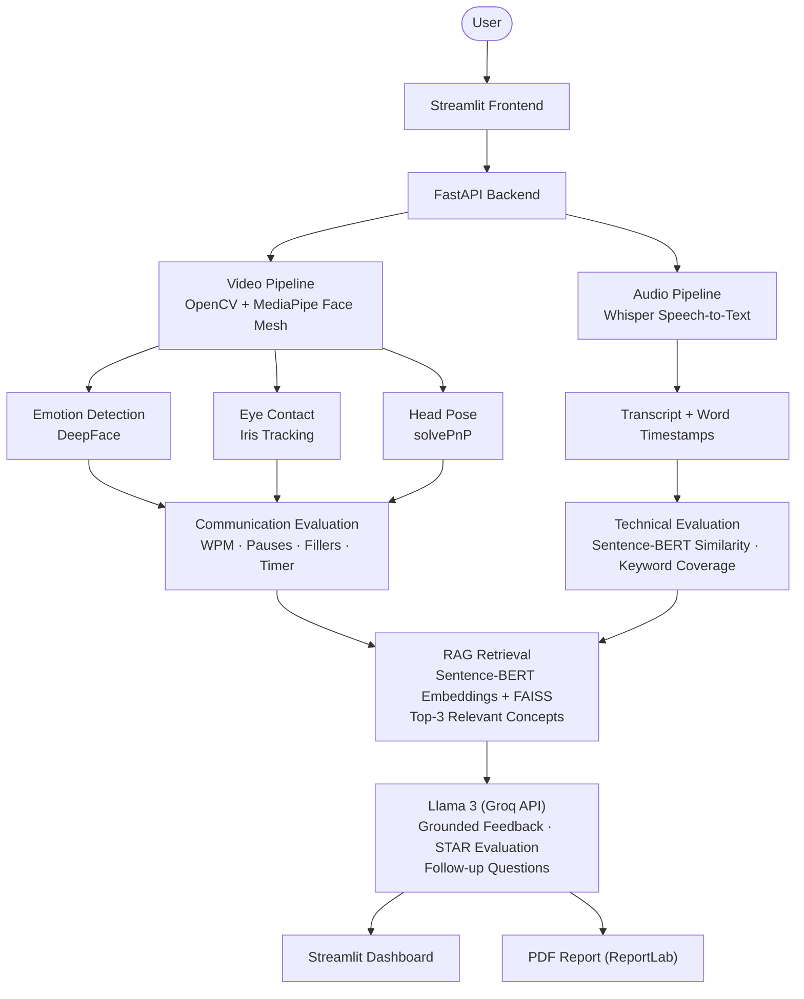

# MirrorMind — AI Interview Coach with RAG-Grounded Feedback

[](https://python.org)
[](https://fastapi.tiangolo.com)
[](https://streamlit.io)
[](https://www.docker.com)
[](https://github.com/facebookresearch/faiss)

> Watches you through the webcam, listens to your answer, and gives you grounded interview feedback — not just a keyword match against a model answer.

**[Watch the demo](https://youtu.be/LGOjw2AxfDY)** · Fully containerized and verified working end-to-end via Docker. Public cloud demo in progress — see [Quick Start](#quick-start) to run it locally in the meantime.

---

## The Problem

Most interview prep tools only check *what* you say — a keyword match against a model answer. They miss how you actually come across: eye contact, pacing, hesitation, rambling. MirrorMind analyzes face, voice, and words together, then grounds its feedback in a real knowledge base instead of generic AI platitudes.

---

## Architecture



MirrorMind is a multimodal pipeline: the Streamlit frontend talks to a FastAPI backend, which processes webcam video and microphone audio independently before combining both into a single evaluation.

**Video Processing** — OpenCV captures webcam frames; MediaPipe Face Mesh extracts facial landmarks once per frame. Those same landmarks are reused for DeepFace emotion detection, eye-contact estimation, and head-pose tracking, instead of running three separate face detections.

**Audio Processing** — Whisper transcribes speech with word-level timestamps. The transcript is analyzed for speaking pace (WPM), pauses, filler words, and answer duration.

**Technical Evaluation** — Sentence-BERT computes semantic similarity between the candidate's answer and the ideal answer; keyword coverage is blended in to produce the technical score.

**RAG Pipeline** — the transcript is embedded with Sentence-BERT and queried against a FAISS index built from the full question bank. The top-3 most relevant concepts are retrieved and injected into the Llama 3 prompt as grounding context.

**LLM Feedback** — Llama 3 (via Groq) generates structured feedback: strengths, weaknesses, suggestions, STAR evaluation, and a follow-up question, using the retrieved context.

**Output** — the dashboard shows communication metrics, technical evaluation, and an emotion timeline; a ReportLab PDF captures the full report.

---

## Screenshots

**Homepage**


**Live Session** — real-time webcam feed with live emotion, eye contact, and head pose tracking


**Communication Results** — WPM, filler words, pauses, and a full emotion timeline across the session


**Technical Evaluation** — similarity score and keyword coverage, computed via Sentence-BERT cosine similarity rather than simple string matching


<!-- TODO: add screenshots for the Setup tab and the Final Results tab, then replace this comment -->

---

## Features

| Feature | Description |
|---|---|
| Real-Time Face Analysis | MediaPipe Face Mesh (468 landmarks) + DeepFace emotion detection, smoothed over a rolling window to avoid frame-to-frame flicker |
| Eye Contact Tracking | Iris landmark tracking against eye-region geometry, reported as a live percentage |
| Head Pose Estimation | `solvePnP`-based yaw/pitch/roll classification (Forward/Left/Right/Up/Down) |
| Speech-to-Text | OpenAI Whisper transcribes answers with word-level timestamps |
| Communication Scoring | WPM, filler word detection, pause/hesitation detection, answer-length classification against defined ideal ranges |
| RAG-Grounded Feedback | Sentence-BERT + FAISS retrieve the most relevant concepts from the question bank; Llama 3 generates feedback grounded in that retrieved context, not just its own parametric knowledge |
| Semantic Technical Scoring | Cosine similarity between the candidate's answer and an ideal answer, blended with keyword coverage |
| STAR Framework Evaluation | For behavioral questions, an LLM pass checks for Situation/Task/Action/Result and flags what's missing |
| AI Follow-Up Questions | Llama 3 generates a relevant follow-up question based on the candidate's actual answer |
| Live Evaluation Dashboard | Communication, Technical, and Final tabs with Plotly charts, a radial score gauge, and structured AI feedback |
| PDF Interview Report | ReportLab-generated report with transcript, metrics, STAR evaluation, and final score |

---

## RAG Pipeline — How It Actually Works

This isn't a "RAG" label on top of a normal LLM call — it's a real retrieval loop:

1. **Index build (once, at startup):** every `ideal_answer` in the question bank is embedded with `all-MiniLM-L6-v2` (Sentence-BERT) and loaded into a FAISS `IndexFlatL2` index.
2. **Retrieval:** when a candidate finishes answering, their transcript is embedded and used to query the index for the top-3 most semantically similar concepts across the *entire* question bank — not just the question they were asked.
3. **Augmentation:** the retrieved concepts (question + reference explanation) are formatted and injected directly into the feedback-generation prompt.
4. **Generation:** Llama 3, called through Groq in JSON mode for guaranteed valid structured output, writes feedback grounded in that retrieved context.

**Example from a real run:** a candidate answering "what's the difference between `==` and `is` in Python?" received feedback connecting their answer to list/tuple mutability — a different question entirely in the bank — because retrieval correctly surfaced it as conceptually related. That's genuine retrieval-augmented grounding, not the model improvising.

---

## Scoring Formulas

```
communication_score = (
   0.35 × eye_contact_component +
   0.35 × wpm_component +
   0.15 × filler_penalty_component +
   0.15 × pause_penalty_component
) × 100

technical_score = 0.6 × similarity_pct + 0.4 × keyword_coverage_pct

overall_score = 0.5 × technical_score + 0.5 × communication_score
```

- `wpm_component` peaks at the ideal 110–150 WPM midpoint (130) and decays linearly the further actual WPM drifts from it.
- `filler_penalty_component` and `pause_penalty_component` decay linearly up to a cap of 10 occurrences.
- All weights are configurable constants in `charts.py`, not hardcoded values buried in logic.

---

## Engineering Highlights

- **Single landmark extraction per frame** — MediaPipe Face Mesh runs once per frame; emotion detection, eye contact, and head pose all reuse the same 478 landmarks instead of triggering three separate face detections, keeping the live loop fast.
- **Emotion smoothing** — a bounded `deque(maxlen=20)` sliding window returns the mode emotion label, preventing frame-to-frame flicker without unbounded memory growth over long sessions.
- **JSON-mode LLM calls** — feedback and STAR evaluation use Groq's `response_format={"type": "json_object"}` instead of parsing free-text output, eliminating a class of malformed-JSON failures from unescaped characters in generated text.
- **Real RAG, not a relabeled prompt** — retrieval queries a FAISS index built from the entire question bank, not just the current question, so feedback can surface relevant concepts the candidate never directly addressed.
- **Decoupled audio pipeline** — recording runs on its own thread so a 60-second answer capture never blocks the live video polling loop.
- **Snapshot-on-evaluation** — video/audio state is frozen into `st.session_state` at the moment an answer is scored, so the Results dashboard doesn't drift as the live webcam keeps running afterward.

---

## Tech Stack

| Layer | Technology | Purpose |
|---|---|---|
| Backend | FastAPI, Uvicorn | REST API + WebSocket-style state polling |
| Computer Vision | OpenCV, MediaPipe, DeepFace | Webcam capture, face landmarks, emotion detection |
| Speech | OpenAI Whisper | Speech-to-text with word-level timestamps |
| NLP / RAG | Sentence-BERT (`all-MiniLM-L6-v2`), FAISS | Semantic similarity scoring + retrieval-augmented generation |
| LLM | Groq API, Llama 3.3 (70B) | Feedback generation, STAR evaluation, follow-up questions |
| Frontend | Streamlit | Interactive web dashboard |
| Visualization | Plotly | Emotion timeline, communication metric charts |
| PDF | ReportLab | Structured interview report export |
| Deployment | Docker | Containerized, verified working locally |
| Config | python-dotenv, Pydantic Settings | Environment variable + settings management |

---

## Project Structure

```
MirrorMind/
├── backend/
│   ├── main.py                  # FastAPI entrypoint
│   ├── routes/                  # video, audio, interview, evaluation, report routes
│   ├── core/                    # config.py, state_manager.py
│   ├── schemas/                 # Pydantic request/response models
│   ├── video/                   # webcam, face detection/landmarks, emotion,
│   │                             # eye contact, head pose, emotion smoothing
│   ├── audio/                    # recorder, Whisper transcription, WPM,
│   │                             # pause detection, filler words, answer timer
│   ├── nlp/                     # embeddings.py, similarity_score.py, vector_store.py (FAISS)
│   ├── llm/                     # groq_client, followup_question, feedback_generator
│   │                             # (RAG-enhanced), star_evaluator
│   ├── data/                    # questions.json — question bank
│   ├── reports/                 # pdf_generator.py (ReportLab)
│   └── utils/
│
├── frontend/
│   ├── app.py                   # Streamlit entrypoint
│   └── components/              # dashboard.py, charts.py, styles.py
│
├── docker/
│   ├── Dockerfile
│   └── docker-compose.yml
│
├── tests/
├── docs/
├── .env.example
├── .gitignore
└── requirements.txt
```

---

## Quick Start

### Prerequisites

- Python 3.10
- FFmpeg (system install, required by Whisper)
- Groq API key

### Setup (Windows)

```powershell
git clone https://github.com/sandeepkumarcm/MirrorMind.git
cd MirrorMind

python -m venv venv
venv\Scripts\activate

pip install -r requirements.txt

copy .env.example .env
# edit .env and add your GROQ_API_KEY

# Terminal 1 — backend
uvicorn backend.main:app --reload

# Terminal 2 — frontend
cd frontend
streamlit run app.py
```

Backend runs at `http://127.0.0.1:8000` · Frontend opens at `http://localhost:8501`

### Run with Docker

```powershell
docker compose -f docker/docker-compose.yml build
docker compose -f docker/docker-compose.yml up
```

Both the FastAPI backend and Streamlit frontend start inside a single container, built and verified working from a clean image on Docker Desktop.

---

## Current Limitations

- English only — no multilingual speech recognition or evaluation.
- Question bank covers 50 questions across 5 categories (10 each); broader coverage would need a larger bank.
- Whisper's `base` model occasionally mis-transcribes near-homophones (e.g., "is" → "ease") in fast speech, which can surface as an odd point in AI feedback.
- Communication scoring weights are fixed defaults, not personalized per interview type (technical vs. behavioral).
- No persistent user accounts — session data resets on refresh.
- Not yet deployed to a public cloud host — currently run via local Python or Docker.

---

## Future Roadmap

- Deploy to a persistent cloud host with a public live demo link.
- Expand the question bank beyond 50 questions and add difficulty-adaptive selection.
- Multi-turn interviews using the AI follow-up question feature end-to-end.
- Persistent session history across visits (currently in-memory only).
- Swap Whisper `base` for `small`/`medium` to reduce transcription errors.
- True WebRTC-based video streaming to replace the current HTTP-polling camera feed.

---

## Resume Line

```
Built MirrorMind, an AI interview coach combining real-time computer vision
(MediaPipe, DeepFace), speech recognition (Whisper), and a retrieval-augmented
generation pipeline (Sentence-BERT, FAISS, Llama 3) to deliver grounded,
concept-aware interview feedback — containerized with Docker.
```

---

## Links

| | |
|---|---|
| Demo Video | [youtu.be/LGOjw2AxfDY](https://youtu.be/LGOjw2AxfDY) |
| GitHub | [github.com/sandeepkumarcm](https://github.com/sandeepkumarcm) |

---

## Author

**Sandeepkumar**

[](https://www.linkedin.com/in/sandeepkumarcm/)
[](https://github.com/sandeepkumarcm)
